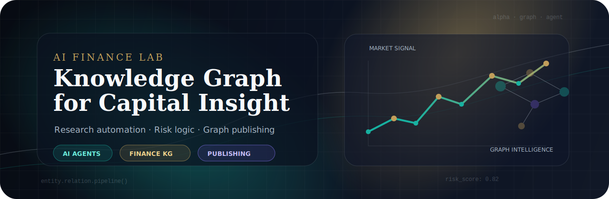
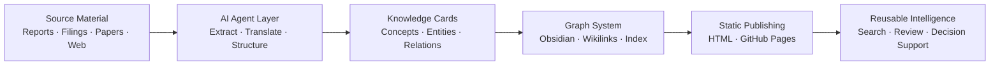

# 滔哥 · AI Finance Knowledge Architect

**把金融研究、AI Agent 与知识图谱工程连接起来，构建可复用、可验证、可演进的行业认知系统。**

---

## 专业定位

> I build **AI-native finance knowledge systems**: from raw financial material and technical papers to structured cards, connected graphs, and deployable interactive websites.

<table>
  <tr>
    <td width="33%" valign="top">
      <h3>金融研究</h3>
      
聚焦供应链金融、消费金融、汽车金融、国际信贷、保险与金融科技，把业务逻辑拆成概念、角色、流程、风险与案例。

    </td>
    <td width="33%" valign="top">
      <h3>AI 工程</h3>
      
使用 AI Agent 完成资料收集、知识抽取、翻译整理、结构化写作、代码生成与静态站点自动化构建。

    </td>
    <td width="33%" valign="top">
      <h3>知识图谱</h3>
      
以 Markdown、Obsidian、Wikilinks 与 GitHub Pages 构建可浏览、可复用、可持续迭代的行业知识资产。

    </td>
  </tr>
</table>

---

## 能力雷达

| Capability | What I Build | Output |
|---|---|---|
| **Financial Knowledge Engineering** | 行业框架、业务链路、风控体系、监管政策、公司案例 | 结构化金融知识库 |
| **AI Research Automation** | 资料筛选、论文/报告提炼、概念卡片、长文重构 | AI 辅助研究流水线 |
| **Knowledge Graph Publishing** | 双向链接、主题索引、交互式页面、GitHub Pages 部署 | 可访问的静态知识站点 |
| **AI Coding Workflow** | Claude Code / Agentic Coding / 自动化脚本 | 从内容到产品的快速迭代 |

---

## 金融知识图谱矩阵

<table>
  <tr>
    <th align="left">Domain</th>
    <th align="left">Knowledge Asset</th>
    <th align="left">Signal</th>
    <th align="left">Repo</th>
  </tr>
  <tr>
    <td><b>Supply Chain Finance</b></td>
    <td>供应链金融知识图谱</td>
    <td>64 张知识卡片 · 六大维度</td>
    <td><a href="https://github.com/ghoulvspol/supply-chain-finance">Open</a></td>
  </tr>
  <tr>
    <td><b>Consumer Finance</b></td>
    <td>消费金融公司与业务体系</td>
    <td>31 家持牌公司 · 行业地图</td>
    <td><a href="https://github.com/ghoulvspol/consumer-finance-knowledge-graph">Open</a></td>
  </tr>
  <tr>
    <td><b>Auto Finance</b></td>
    <td>汽车金融全业务链</td>
    <td>产品、场景、风险、参与方</td>
    <td><a href="https://github.com/ghoulvspol/auto-finance-knowledge-graph">Open</a></td>
  </tr>
  <tr>
    <td><b>International Credit</b></td>
    <td>国际信贷业务体系</td>
    <td>跨境信贷 · 业务结构化</td>
    <td><a href="https://github.com/ghoulvspol/intl-credit-knowledge-graph">Open</a></td>
  </tr>
  <tr>
    <td><b>FinTech</b></td>
    <td>金融科技公司图谱</td>
    <td>32 家头部公司 · 技术与商业模式</td>
    <td><a href="https://github.com/ghoulvspol/fintech-knowledge-graph">Open</a></td>
  </tr>
  <tr>
    <td><b>Auto Insurance</b></td>
    <td>汽车保险知识库</td>
    <td>业务体系 · 风险保障 · 场景拆解</td>
    <td><a href="https://github.com/ghoulvspol/auto-insurance-knowledge-graph">Open</a></td>
  </tr>
</table>

---

## AI & 科技知识资产

| Project | Focus | Highlights |
|---|---|---|
| [AI Models Knowledge Graph](https://github.com/ghoulvspol/ai-models-knowledge-graph) | 大模型技术全景 | 35+ 模型 · 120 页 · 1243 条链接 |
| [AI Coding Knowledge Graph](https://github.com/ghoulvspol/ai-coding-knowledge-graph) | AI 编程体系 | Agentic Coding、工具链、方法论 |
| [Tesla Knowledge Graph](https://github.com/ghoulvspol/tesla-knowledge-graph) | 公司与产品战略 | 23 年成长史 · 产品矩阵 |
| [SpaceX Knowledge Graph](https://github.com/ghoulvspol/spacex-knowledge-graph) | 航天技术与商业化 | 技术路径 · 任务体系 |
| [FIFA World Cup KG](https://github.com/ghoulvspol/fifa-worldcup-kg) | 体育知识工程 | 95 页 · 1839 条双向链接 |
| [Paper Helper](https://github.com/ghoulvspol/paper-helper) | 论文转交互式教程 | Academic paper → HTML learning experience |

---

## AI Finance Production Pipeline

---

## 代表项目

<table>
  <tr>
    <td width="50%" valign="top">
      <h3><a href="https://github.com/ghoulvspol/supply-chain-finance">供应链金融知识图谱</a></h3>
      
覆盖核心概念、参与主体、业务模式、风控体系、政策法规、典型案例六大维度，把复杂金融业务拆解为可学习、可链接的知识卡片。

    </td>
    <td width="50%" valign="top">
      <h3><a href="https://github.com/ghoulvspol/ai-models-knowledge-graph">AI 模型知识图谱</a></h3>
      
面向 2023-2026 大模型技术演进，沉淀模型谱系、关键概念、能力边界与生态关系，形成可持续更新的技术地图。

    </td>
  </tr>
  <tr>
    <td width="50%" valign="top">
      <h3><a href="https://github.com/ghoulvspol/paper-helper">Paper Helper</a></h3>
      
将学术论文转换为结构清晰、视觉友好、可交互浏览的 HTML 教程，降低专业知识的理解门槛。

    </td>
    <td width="50%" valign="top">
      <h3><a href="https://github.com/ghoulvspol/fintech-knowledge-graph">金融科技知识图谱</a></h3>
      
围绕头部金融科技公司、业务模型、技术能力与产业价值链，构建面向研究和决策的行业认知底座。

    </td>
  </tr>
</table>

---

## Tech Stack

---

## GitHub Analytics

---

### 以金融的严谨，驾驭 AI 的速度；以知识图谱的结构，沉淀长期复利。

